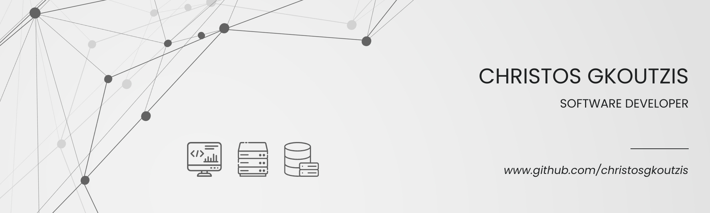

<h2 align="center">Hello world! I am Christos, a self-taught full stack web developer. 💻</h2>

I've recently completed Harvard's CS50x and I feel ready to embark on this exciting journey of CS and be a part of amazing projects 😆

<em>
<a href="">If you want to know more about me check this simple website I created during one of the Problems Sets of CS50</a>
</em>

### 💾 Projects that I've created

YouTube Frontpage Clone

  
Summary: An updated and responsive version of the final project of the HTML-CSS course by SuperSimpleDev.
<a href="https://github.com/christosgkoutzis/YouTube-frontpage-clone">Project's Repository</a>
<a href="https://christosgkoutzis.github.io/YouTube-frontpage-clone/>Have a look at the project!</a>

### 🔧 Open source projects that I have contributed

### 💻 Projects that I am working on
- Muses (A website of a contemporary art museum based in Athens, Greece)

### 👨‍💻 Programming/Markup languages, frameworks and other Web Development technologies I've worked with

  #### Programming Languages
  - C
  - Python 
  - JavaScript 
  
  #### Markup Languages
  - HTML5
  - CSS3
  
  #### Frameworks
  - Bootstrap 5
  - Flask
  
  #### CMS
  - WordPress
  
  #### Version Control
  - Git

### 👨‍🎓 What I am currently learning

  - PHP

### 📞 Contact Info

