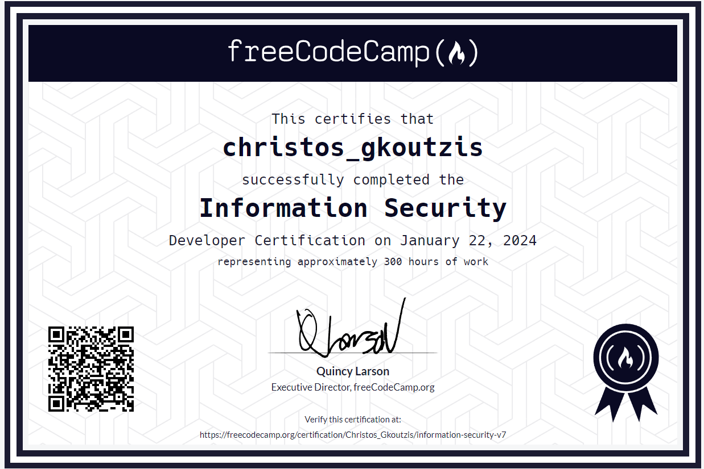

<h2 align="center">Hello world! I am Christos, a self-taught full stack web developer. 💻</h2>

I've recently completed Harvard's CS50x and I feel ready to embark on this exciting journey of Computer Science and be a part of amazing projects 😆

<em>
<a href="https://christosgkoutzis.github.io/About-me/">If you want to know more about me check this simple website I created during one of the Problems Sets of CS50</a>
</em>

### 💾 Projects that I've created

 

	

 YouTube Frontpage Clone 
  

- **Summary:** An updated and responsive version of the final project of the HTML-CSS course by SuperSimpleDev.  

- <a href="https://github.com/christosgkoutzis/YouTube-frontpage-clone">Project's Repository</a>  

- <a href="https://christosgkoutzis.github.io/YouTube-frontpage-clone/">Have a look at the project!</a>  

	

 Personal Homepage 
  

- **Summary:** An introductory simple 4-page website, developed with front-end technologies (HTML, CSS, JavaScript, Bootstrap) that contains basic information about my career, my interests and my future ambitions.  

- <a href="https://github.com/christosgkoutzis/About-me">Project's Repository</a>  

- <a href="https://christosgkoutzis.github.io/About-me/">Have a look at the project!</a>  

	

 Information Security Certification Projects 
  

- **Summary:** A collection of 4 projects including 2 full stack web applications developed using the MERN stack (a NASDAQ Stock Price Checker and an Anonymous Message Board) and 2 Python programs (a SHA-1 Password Cracker and a Port Scanner) that I've built during my Information Security Certificatation by FreeCodeCamp.  

- <a href="https://github.com/christosgkoutzis/Information_Security_Certification">Projects's repository</a>  

 

### 🔧 Open source projects that I have contributed

 

### 💻 Projects that I am working on

 

* Muses (A website of a contemporary art museum based in Athens, Greece)

 

### 👨‍💻 Programming/Markup languages, frameworks and other Web Development technologies I've worked with

  - **Programming Languages**
  
      - C
        
      - Python
        
      - JavaScript 
  
  - **Markup Languages**
  
      - HTML5
        
      - CSS3
  
  - **Frameworks**
  
      - Bootstrap 5
        
      - Flask

      - Express JS

      - SASS (CSS preprocessor)

  - **Databases**
  
      - SQL (Relational)
        
      - MongoDB (Non Relational)
    
  - **Version Control**
  
      - Git - GitHub

  - **CMS**
  
      - WordPress

### 👨‍🎓 Certificates

	

 CS50x (Harvard University's Introduction to Computer Science and the arts of Programming) 
  

  

	

 Information Security Certification (300 hour FreeCodeCamp curriculum on user security threats in web applications and web technologies to protect them) 
  

  

  
### 📖 What I am currently learning

  - React JS

  - Next JS

### 📞 Contact Info

 - Email: christosgkoutzis@gmail.com

 - LinkedIn: www.linkedin.com/in/christos-gkoutzis-7285972a3 

